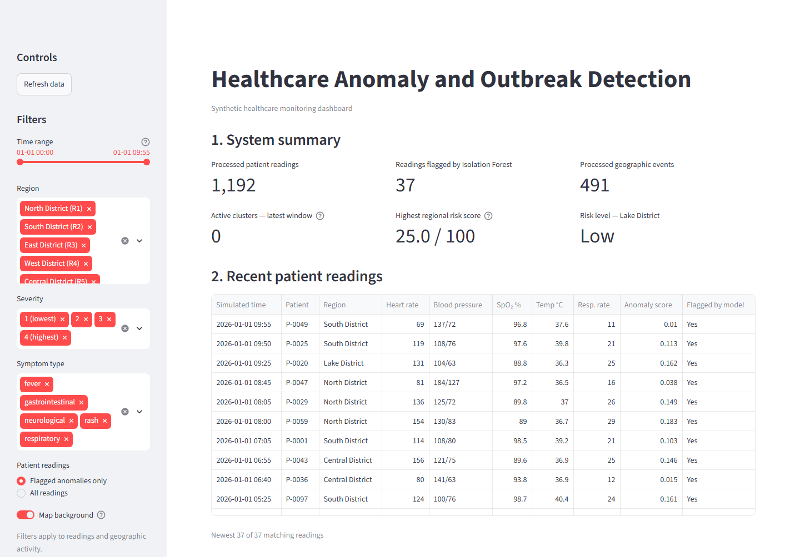
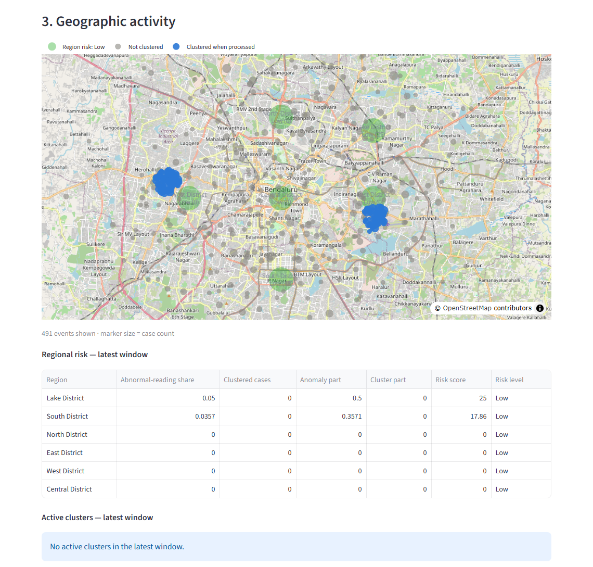
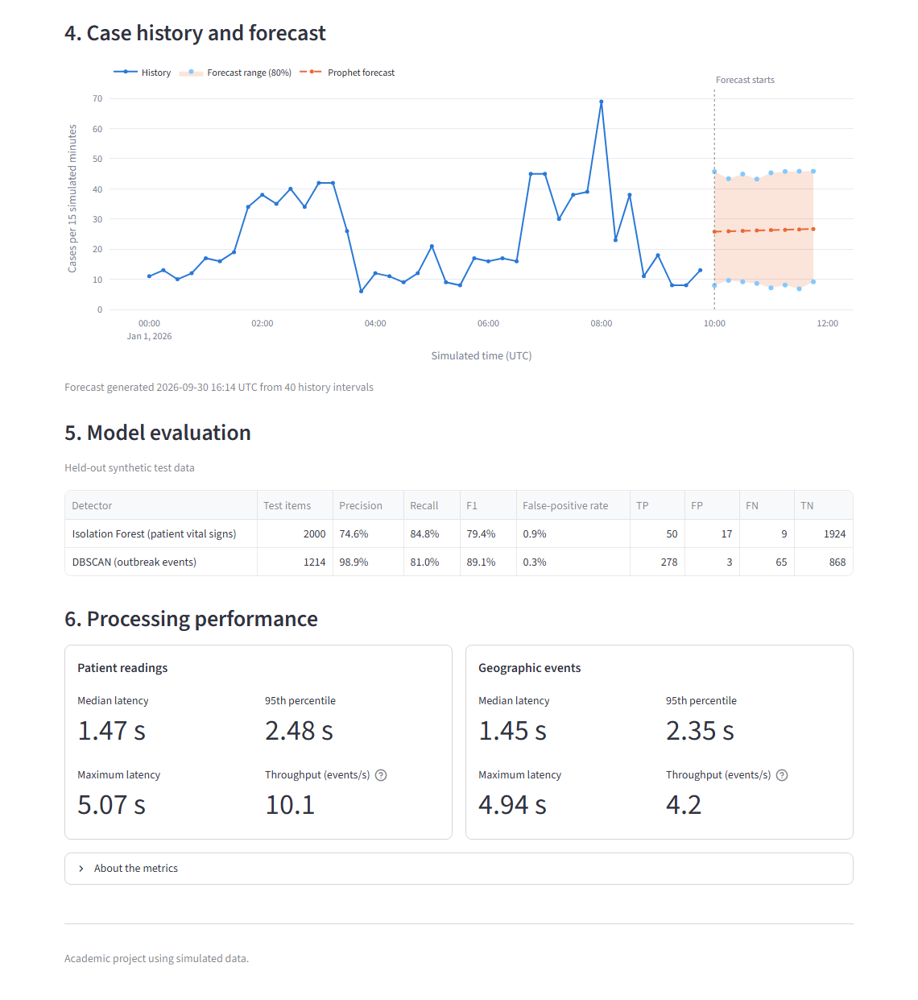

# Autonomous Real-Time Healthcare Anomaly and Outbreak Detection System

An entry-level Bachelor of Computer Science academic project. It processes a
simulated stream of healthcare events with local PySpark Structured Streaming,
flags abnormal patient vital signs with Isolation Forest, finds geographic
clusters of distress events with DBSCAN, combines both into a simple regional
risk score, forecasts short-term case counts with Prophet and shows everything
on an interactive Streamlit dashboard.

> **SYNTHETIC DATA NOTICE**
> Every patient, reading, location, outbreak and result in this project is
> **simulated** and intended **only for academic demonstration**. It is not a
> clinical system, has not been clinically validated, and **must not be used
> for any medical or public-health decision**. Region names are fictional; map
> coordinates are arbitrary positions used only to draw the map.
>
> - All metrics are calculated on **synthetic** data and depend on how the
>   generator was configured; they do not show real clinical performance.
> - The risk score is a **simple heuristic, not a probability**.
> - Forecasts are **not clinically validated**.
> - Performance figures come from **one local academic demonstration** on a
>   single desktop PC, not from a formal benchmark.

## Screenshots

Final dashboard, showing the results of the live run described below (stream seed 101).

**Overview:** summary tiles, filters and flagged patient readings


**Geographic activity:** events on an OpenStreetMap background, regional risk and active clusters


**Case history and forecast, model evaluation and processing performance**


## How it works

```
generate_data.py  ──►  data/incoming/vitals/*.json, data/incoming/geo/*.json
      │                  (one file per tick; events carry event_time and created_at)
      └──────────────►  data/labels/   (ground truth, never read by the pipeline or the models)

spark_pipeline.py  (PySpark Structured Streaming, two queries in one local[2] process)
   vitals: read JSON → validate → Isolation Forest score → SQLite
   geo:    read JSON → validate → SQLite
           → geo events of the last 60 simulated minutes (across micro-batches)
           → DBSCAN → clusters → regional risk score → SQLite

forecast.py (run by hand)    ──►  Prophet forecast of case counts per 15 simulated minutes → SQLite
SQLite (data/healthcare.db)  ──►  dashboard.py (Streamlit, read only, http://localhost:8501)

train_models.py  ──►  trains Isolation Forest and evaluates both detectors on held-out synthetic data
run_demo.py      ──►  runs generate → Spark → forecast with one command
```

- **Synthetic generator** (`generate_data.py`): simulates 100 patients in six
  fictional districts. Every tick (5 simulated minutes) writes 10 vital-sign
  readings and a few geographic distress events. About 3% of readings follow
  one of five abnormal patterns, about 1% are deliberately corrupted to test
  validation, and a synthetic outbreak starts on a fixed schedule (tick 20, then
  every 60 ticks). Normal readings always keep systolic pressure at least 10 mmHg
  above diastolic. The same seed always produces the same events.
- **PySpark Structured Streaming** (`spark_pipeline.py`): watches the two input
  folders, validates each micro-batch (required fields, physically possible
  ranges, systolic above diastolic, valid case counts) and hands the valid rows
  to pandas for detection. It runs locally as `local[2]` with two shuffle
  partitions and listens only on `127.0.0.1`.
- **Isolation Forest** (`detection.py`): an unsupervised model trained on vital
  signs only (no labels). Readings with a score above 0 are flagged.
- **DBSCAN** (`detection.py`): clusters the geographic events of the last 60
  simulated minutes using haversine distance (neighbours within 0.5 km, at
  least 5 events per cluster). It runs again each time new events arrive.
- **Combined risk score:** see below.
- **SQLite** (`database.py`): one database file in WAL mode. Tables:
  `vitals_results`, `geo_events`, `clusters`, `region_risk`, `forecasts`.
  Every processed event stores `created_at`, `processed_at` and
  `latency_seconds`. Re-processed events are ignored (`INSERT OR IGNORE`).
- **Prophet** (`forecast.py`): see below.
- **Streamlit** (`dashboard.py`): see below.

### Risk score (simple academic heuristic)

For each region, over the last 60 simulated minutes:

```
anomaly_part = min(share of abnormal vital readings / 0.10, 1)
cluster_part = min(cases inside DBSCAN clusters / 20, 1)
risk_score   = 100 × (0.5 × anomaly_part + 0.5 × cluster_part)
risk_level   = Low (< 30), Medium (30–59), High (≥ 60)
```

Both parts are stored next to the score so the result can be explained. This is
a **simple academic heuristic**: it is **not a probability**, not a medical
prediction and **not clinically validated**.

### Prophet forecast (`forecast.py`)

`forecast.py` runs only when you start it (or through `run_demo.py`). It:

1. reads the processed geographic events (`event_time`, `case_count`) from SQLite;
2. adds up the cases per **15 simulated minutes** (empty intervals count as 0;
   the newest interval is left out while it is still filling up);
3. needs at least **12** complete intervals (3 simulated hours) of history;
4. fits a simple **trend-only** Prophet model (the synthetic history covers
   hours, not days, so daily/weekly/yearly seasonality are switched off);
5. forecasts the next **8** intervals (2 simulated hours) with an 80% range;
6. replaces the previous forecast in the `forecasts` table in one transaction.

Case counts cannot be negative, so values below 0 are stored as 0. The
settings are in `config.py` (`FORECAST_*`). This is a forecast of **synthetic**
data, **not** a clinical or public-health prediction, and no forecast accuracy
has been measured.

### Streamlit dashboard (`dashboard.py`)

The dashboard only **reads** results through short read-only SQLite
connections. It never writes to the database, trains models, starts Spark or
generates data, and it never shows the ground-truth labels. It has six sections:

1. **System summary**: processed readings, readings flagged by Isolation
   Forest, geographic events, *Active clusters — latest window* (clusters in the
   newest DBSCAN window only) and the highest regional risk score and level.
2. **Recent patient readings**: vital signs, anomaly score and the model's flag.
3. **Geographic activity**: a map (OpenStreetMap background, no API key) of
   events and the regions' latest risk level, plus the regional risk and active
   cluster tables. Grey events were not clustered; blue events (*Clustered when
   processed*) belonged to a cluster in the most recent DBSCAN window that
   included them, so they can remain after that cluster has ended. Without
   internet, switch off *Map background* for a plain latitude/longitude chart.
4. **Case history and forecast**: cases per 15 simulated minutes, the Prophet
   forecast and its 80% range.
5. **Model evaluation**: the held-out synthetic results saved by
   `train_models.py` (precision, recall, F1, false-positive rate, confusion matrix).
6. **Processing performance**: median, 95th-percentile and maximum latency and
   throughput, separately for patient readings and geographic events.

A collapsed **About the metrics** section explains each value briefly. Sidebar
filters (time range, region, severity, symptom type, flagged-only or all
readings) apply to the patient table and the geographic activity section.
Click **Refresh data** to re-read the database; the page does not refresh by
itself. A distinct count of historical outbreaks is deliberately not shown,
because DBSCAN re-runs on an overlapping window and records one outbreak under
several window-specific cluster IDs.

## Project structure

```
healthcare-anomaly-outbreak-detection/
├── config.py              all settings: paths, seeds, simulation, models, Spark, forecast
├── generate_data.py       synthetic events and separate ground-truth labels
├── detection.py           Isolation Forest, DBSCAN (haversine) and the risk-score heuristic
├── train_models.py        trains Isolation Forest, evaluates both detectors on held-out data
├── database.py            SQLite tables (WAL mode) and small read/write helpers
├── spark_pipeline.py      Structured Streaming pipeline (once or continuous mode)
├── forecast.py            Prophet forecast of case counts
├── dashboard.py           read-only Streamlit dashboard
├── run_demo.py            one-command demonstration (generate → Spark → forecast → checks)
├── setup_windows.ps1      checks Java 17 and .venv, downloads and verifies the Spark JAR
├── requirements.txt       Python packages (PySpark pinned to 4.2.0)
├── .streamlit/config.toml dashboard listens on 127.0.0.1:8501 only, no usage statistics
├── tests/                 pytest tests (none of them start Spark)
├── screenshots/           dashboard images used in this README
├── jars/                  compatibility JAR (downloaded, not committed)
├── models/                trained model (generated, not committed)
└── data/                  stream files, labels, training data, SQLite, checkpoints, results (generated, not committed)
```

## Windows prerequisites

- Windows 10 or 11 with PowerShell
- Python 3.12
- Eclipse Temurin JDK 17 (Java 17)
- Internet access for installing packages, downloading the compatibility JAR
  and drawing the map background (the dashboard also works offline without the map tiles)

Verified with Python 3.12.10, Java 17, PySpark 4.2.0, scikit-learn 1.9.1,
Prophet 1.4.0, Streamlit 1.64.0 and Plotly 7.1.0 on Windows 10 Pro.

## Installation (Windows PowerShell)

```powershell
# 1. Get the project and enter its folder
git clone https://github.com/laharip1418/healthcare-anomaly-outbreak-detection.git
cd healthcare-anomaly-outbreak-detection

# 2. Install Java 17 (skip if `java -version` already shows 17), then open a NEW PowerShell window
winget install --id EclipseAdoptium.Temurin.17.JDK --exact
java -version

# 3. Create and activate the virtual environment
py -3.12 -m venv .venv
.\.venv\Scripts\Activate.ps1

# 4. Install the packages (inside .venv only)
python -m pip install -r requirements.txt

# 5. Windows setup: checks Java and .venv, downloads the compatibility JAR
.\setup_windows.ps1
```

If PowerShell blocks `Activate.ps1` or `setup_windows.ps1`, run
`Set-ExecutionPolicy -Scope Process -ExecutionPolicy Bypass` (affects only the
current window) or call `.\.venv\Scripts\python.exe` directly.

## Spark on Windows

Spark normally needs the native Hadoop files `winutils.exe` and `hadoop.dll`
to read and write local files on Windows. Apache does not publish official
Windows builds of them, so this project **does not use them**. Instead:

1. `setup_windows.ps1` downloads one small (about 9 KB) pure-Java JAR from
   Maven Central, `com.globalmentor:hadoop-bare-naked-local-fs:0.1.0`, into
   `jars/`, and checks its SHA-256 and the SHA-1 published by Maven Central.
   The JAR is not committed to Git.
2. Spark receives that project-relative JAR through `--driver-class-path`
   **before** PySpark starts (in the `PYSPARK_SUBMIT_ARGS` environment
   variable), so Java can load it at startup.
3. Spark uses these two settings (both in `config.py`):
   - `spark.hadoop.fs.file.impl` =
     `com.globalmentor.apache.hadoop.fs.BareLocalFileSystem`
   - `spark.sql.streaming.checkpointFileManagerClass` =
     `org.apache.spark.sql.execution.streaming.checkpointing.FileSystemBasedCheckpointFileManager`
4. These warnings are expected with this setup:
   - `WARN Shell: Did not find winutils.exe ... HADOOP_HOME and hadoop.home.dir are unset`
   - `WARN NativeCodeLoader: Unable to load native-hadoop library for your platform`

## Running the project

All commands run from the project folder with the virtual environment active.
They were verified on 30 Sep 2026.

### First time: train the model

```powershell
python generate_data.py --mode train     # training and held-out test data (seeds 42 and 43)
python train_models.py                   # trains Isolation Forest, writes data/results/phase2_evaluation.json
```

### One-command demonstration

```powershell
python run_demo.py --seed 101
```

`run_demo.py` checks the packages, trained model, Spark JAR, Java and project
scripts; lists what it will replace (stream files, the demonstration database,
Spark checkpoints and the previous forecast) and asks for confirmation; then
runs, one after another:

1. `generate_data.py --mode stream --fresh --seed 101 --ticks 120 --seconds-per-tick 0`
2. `spark_pipeline.py --mode once --reset`
3. `forecast.py`

Finally it checks the database (patient results, geographic events, risk rows,
processing times, forecast rows, `PRAGMA integrity_check`) and prints a summary.
It exits with a non-zero status if any step fails. It does not start Streamlit.

Options: `--seed N` (default 44), `--ticks N` (36–600, default 120 = 10
simulated hours, enough for the forecast) and `--yes` (do not ask before
replacing data). The whole run takes about one minute.

Because every stream file is written before Spark starts, the latency shown
after this quick run is **not** a real-time measurement; use the live
demonstration below for that.

### Dashboard

```powershell
python -m streamlit run dashboard.py
```

Open **http://localhost:8501**. It listens only on this computer
(`127.0.0.1:8501`, set in `.streamlit/config.toml`). If it is already open,
click **Refresh data** after a new run. **Stop it with Ctrl+C** in its
PowerShell window.

### Live demonstration (real-time processing)

Use two PowerShell windows, both in the project folder with `.venv` active:

```powershell
# window 1: start the pipeline and wait until it prints "Streaming queries started"
python spark_pipeline.py --mode continuous --reset --stop-after 180

# window 2: write one tick per second for 2 minutes
python generate_data.py --mode stream --fresh --seed 101
```

Afterwards run `python forecast.py` and refresh the dashboard. Without
`--stop-after`, stop the pipeline with **Ctrl+C**.

### Manual step-by-step commands

```powershell
python generate_data.py --mode train                                        # 1. training/test data
python train_models.py                                                      # 2. train and evaluate
python generate_data.py --mode stream --fresh --seed 101 --ticks 120 --seconds-per-tick 0   # 3. stream files
python spark_pipeline.py --mode once --reset                                # 4. process them once
python forecast.py                                                          # 5. forecast
python -m streamlit run dashboard.py                                        # 6. dashboard
python -m pytest                                                            # tests (no Spark)
```

Notes:

- `--seed` (stream mode only) chooses the simulated stream; the default is 44.
  The same seed always produces the same events. Training and held-out test
  data always use the documented seeds 42 and 43.
- `--fresh` deletes stream files from an earlier run; `--reset` deletes the
  SQLite database and Spark checkpoints. Use them together, because new files
  reuse old file names.
- `--seconds-per-tick 0` must be combined with `--ticks`.
- `python <script>.py --help` lists every option of a script.

## Results (synthetic data only)

> All numbers below come from **synthetic data** produced by this project's own
> generator. They depend on how the generator is configured and **do not
> demonstrate real clinical or public-health performance**.

### Tests

`python -m pytest`: **55 tests passed** (generator 13, detection 11, database 9,
forecast 5, dashboard 7, `run_demo.py` 10). The tests do not start Spark; the
Spark pipeline was verified with the one-command demonstration and the live run below.

### Detection on held-out synthetic data (`train_models.py`, 30 Sep 2026)

Isolation Forest was trained without labels on 5,000 readings (seed 42, 165
labelled anomalies) and tested on 2,000 separate readings (seed 43, 59
labelled anomalies, prevalence 2.95%). DBSCAN was replayed over 1,214 held-out
geographic events (seed 43, 343 outbreak events from 5 synthetic outbreaks,
prevalence 28.25%) with a 60-minute sliding window. Settings were chosen
before the test run and not tuned on the test labels; two training runs gave
identical results.

| Detector | Precision | Recall | F1 | False-positive rate | TP / FP / FN / TN |
|---|---|---|---|---|---|
| Isolation Forest (vital signs) | 74.6% | 84.8% | 79.4% | 0.9% | 50 / 17 / 9 / 1,924 |
| DBSCAN (outbreak events) | 98.9% | 81.0% | 89.1% | 0.3% | 278 / 3 / 65 / 868 |

- Recall by synthetic anomaly type: fever, hypotension, hypertensive crisis and
  tachycardia with low oxygen 100%; **bradycardia 0%** (a low heart rate on its
  own is not unusual enough for this model).
- DBSCAN found all 5 synthetic outbreaks; most missed outbreak events are the
  first few of each outbreak, before enough nearby events exist to form a cluster.
- Earlier (Phase 2) the generator occasionally produced normal readings with
  systolic and diastolic pressure too close together. After fixing that in
  Phase 5, Isolation Forest precision changed from 70.4% to 74.6% and F1 from
  76.9% to 79.4% (false positives 21 → 17); recall and all DBSCAN results were
  unchanged, because the fix only changed diastolic values of normal readings.

### Live processing (one short local run, 30 Sep 2026)

Spark in continuous mode (`local[2]`, 2-second trigger, at most 10 files per
micro-batch) while the generator wrote 120 ticks one second apart (stream
seed 101), on one Windows 10 desktop PC (Intel Core i5-6500, 4 cores).
Latency is each stored event's `processed_at − created_at`, so it includes the
wait for the next trigger.

| | Patient readings | Geographic events |
|---|---|---|
| Stored events | 1,192 (8 rejected, all deliberately corrupted) | 491 |
| Median latency | 1.47 s | 1.45 s |
| 95th-percentile latency | 2.48 s | 2.35 s |
| Maximum latency | 5.07 s | 4.94 s |
| Events processed within 3 s | 96.6% | 98.6% |
| Throughput | 10.1 events/s | 4.2 events/s |

The same run flagged 37 readings, stored 35 cluster records over 61 DBSCAN
windows and 366 regional risk rows; the latest window had no active cluster.
Throughput equals the rate at which the generator wrote events, not the
maximum capacity of the pipeline. Not every event was processed within 3 seconds
(maximum about 5 s). This is one short synthetic local run, **not a benchmark**.

The one-command demonstration with the same seed stored exactly the same
events (1,192 readings, 491 geographic events) in about 46 seconds.

### Forecast

With the live-run data, Prophet used 40 history intervals and forecast about
26 cases per 15 simulated minutes for the next 2 simulated hours (80% range
roughly 7 to 46). It is a trend-only model of synthetic case counts; no
forecast accuracy has been measured, so no accuracy figure is claimed.

## Troubleshooting

| Message or symptom | What to do |
|---|---|
| Dashboard: *No results database was found* | Run `python run_demo.py --seed 101`, then click **Refresh data**. |
| `run_demo.py`: *No trained model* / `Model not found at ...` | Run `python generate_data.py --mode train` and `python train_models.py`. |
| `run_demo.py`: *Not running interactively: add --yes* | Add `--yes` to confirm replacing the previous demonstration data. |
| `Missing ...vitals_train.csv` from `train_models.py` | Run `python generate_data.py --mode train` first. |
| Dashboard: *No forecast yet* | Run `python forecast.py`, then click **Refresh data**. |
| `forecast.py`: *Only N complete 15-minute intervals ... at least 12 are needed* | Process a longer stream (at least 36 ticks; 120 gives 40 intervals). |
| Dashboard: *New events have been processed since this forecast was made* | Run `python forecast.py` again. |
| Dashboard: *No evaluation results found* | Run `python train_models.py`. |
| `Event files from an earlier run already exist` | Add `--fresh` to the generator command, and `--reset` to the next pipeline run. |
| `Missing ...jars\hadoop-bare-naked-local-fs-0.1.0.jar` | Run `.\setup_windows.ps1`. |
| `Java 17 was not found` | Install Java 17 and open a new PowerShell window. |
| Map background stays blank | The OpenStreetMap tiles need internet: switch off *Map background* in the sidebar. |
| Very large latency after `run_demo.py` or `--mode once` | Expected: the files were written before Spark started. Use the live demonstration. |
| Port 8501 already in use | Another dashboard is still running: stop it with Ctrl+C in its window. |

## Known limitations

- All data is synthetic; the detectors, risk score and forecast have never
  been tested on real data and must not be used for medical decisions.
- Isolation Forest misses readings whose only abnormal value is a low heart
  rate (bradycardia recall 0% on the held-out synthetic data).
- The regional risk score is a fixed heuristic; its weights and thresholds
  are design choices, not learned or validated values.
- The Prophet model is trend-only because the synthetic history covers hours,
  not days; it forecasts the total case count, not per-region counts.
- Micro-batches are converted to pandas on the driver, which suits this small
  local project but would not scale to large data volumes.
- In continuous mode the risk score uses the vital results already stored when
  geographic events arrive.
- Latency is only a real-time measurement after a live (continuous-mode) run,
  and it was measured in one short local run on one PC.
- The map background needs internet; a latitude/longitude chart is available offline.
- Prophet 1.4 triggers a NumPy deprecation warning (visible in the test
  output); `requirements.txt` keeps NumPy below 2.6 so it cannot become an error.
- The dashboard does not refresh by itself; click **Refresh data**.

## Project status

| Phase | Status |
|---|---|
| 1. Environment, project files, data generator, Windows Spark setup | Complete |
| 2. Isolation Forest, DBSCAN, risk score, evaluation | Complete |
| 3. Spark Structured Streaming pipeline, SQLite, latency measurement | Complete |
| 4. Prophet forecast, Streamlit dashboard, geographic map | Complete |
| 5. Generator fix, stream seeds, one-command demo, final evaluation, screenshots | Complete |
